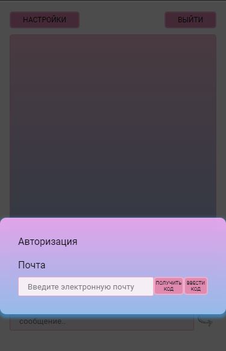
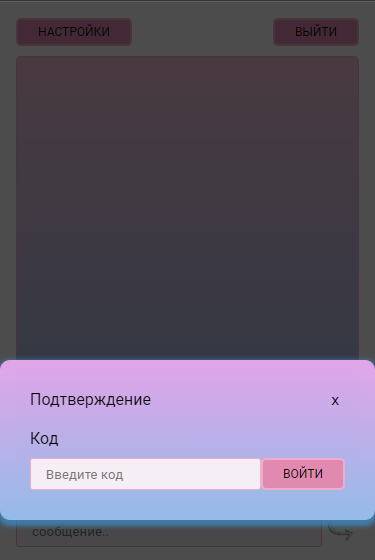
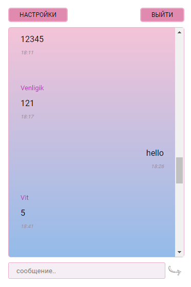
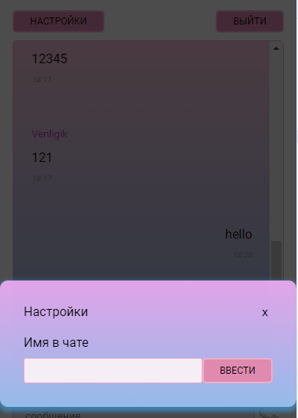

# Chat app

**Chat** -  instant messaging app. 

Features:
- modal window for name change;
- modal mail authorization window;
- modal window for code;
- partial upload of the messages

[Chat Demo](https://65393442dc6dbc0395c2e023--deft-dodol-66ed86.netlify.app/) 

How to use:

1. Type your email. Check your mail, the token will be waiting for you there
2. Type token
3. After that you will see the chat messages

### Technologies

